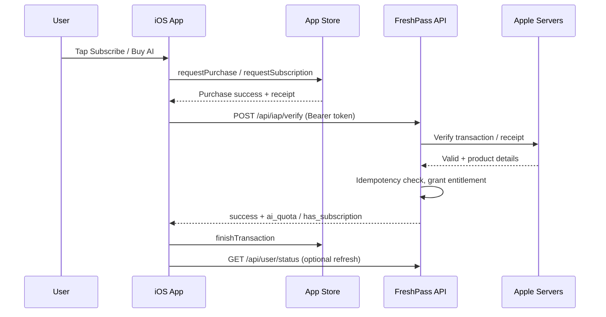

# FreshPass — Apple IAP Backend API Specification

**Audience:** Backend developers  
**Mobile app:** Fresh Pass (React Native / Expo)  
**Bundle ID:** `com.freshpass`  
**Status:** Required for iOS App Store compliance (Guideline 3.1.1)

The iOS app no longer uses Stripe for **digital** purchases inside the app. After a user completes payment in Apple’s sheet, the app calls your API to verify the purchase and unlock entitlements.

---

## 1. Overview

| Flow | `kind` | `referenceId` means | Apple product type |
|------|--------|---------------------|--------------------|
| Business plan subscribe | `business_subscription` | `subscription_plans.id` | Auto-renewable subscription |
| AI credits / unlock | `ai_service` | `additional_services.id` (AI service row) | Consumable (recommended) or non-consumable |

**Platform split (do not change Stripe for these on Android):**

| Platform | Business subscription | AI purchase |
|----------|----------------------|-------------|
| iOS | Apple IAP → `POST /api/iap/verify` | Apple IAP → `POST /api/iap/verify` |
| Android / Web | Existing `POST /api/payment-sheet` | Existing `POST /api/payment-sheet/ai-tools` |

---

## 2. Authentication

All endpoints below require the same **Bearer token** as existing FreshPass APIs (`Authorization: Bearer {accessToken}`).

The authenticated user is the purchaser. Entitlements must be applied to **that user** (and their business, if `kind = business_subscription`).

---

## 3. Primary endpoint — Verify purchase

### `POST /api/iap/verify`

Called once per successful Apple purchase, before the app calls `finishTransaction`.

#### Request headers

```http
Content-Type: application/json
Accept: application/json
Authorization: Bearer {access_token}
```

#### Request body (JSON)

| Field | Type | Required | Description |
|-------|------|----------|-------------|
| `productId` | string | Yes | App Store product identifier (e.g. `com.freshpass.business.plan.1`) |
| `transactionId` | string | Yes | Apple transaction id (unique per purchase) |
| `transactionReceipt` | string | Yes | Receipt data from the client (base64 app receipt or transaction JWS — see §7) |
| `originalTransactionId` | string | No | Subscription original transaction id (iOS subscriptions) |
| `purchaseToken` | string | No | May be present on some clients; store if sent |
| `kind` | enum | Yes | `business_subscription` \| `ai_service` |
| `referenceId` | integer | Yes | Internal FK: plan id or additional_service id |

#### Example — business subscription

```json
{
  "productId": "com.freshpass.business.plan.1",
  "transactionId": "2000000123456789",
  "transactionReceipt": "MIITtAYJKoZIhvcNAQcCoIITpTCC...",
  "originalTransactionId": "2000000123450000",
  "purchaseToken": null,
  "kind": "business_subscription",
  "referenceId": 1
}
```

#### Example — AI service

```json
{
  "productId": "com.freshpass.ai.service.3",
  "transactionId": "2000000987654321",
  "transactionReceipt": "MIITtAYJKoZIhvcNAQcCoIITpTCC...",
  "originalTransactionId": null,
  "purchaseToken": null,
  "kind": "ai_service",
  "referenceId": 3
}
```

#### Success response — `200 OK`

Shape must match existing FreshPass API style:

```json
{
  "success": true,
  "message": "Purchase verified",
  "data": {
    "ai_quota": 20,
    "has_subscription": true,
    "subscription_status": "active"
  }
}
```

| Field in `data` | When required | Used by app |
|-----------------|---------------|-------------|
| `has_subscription` | `kind = business_subscription` | `fetchUserStatus` / business gating |
| `subscription_status` | `kind = business_subscription` | e.g. `active`, `trialing` |
| `ai_quota` | `kind = ai_service` | Updates Redux `user.ai_quota` immediately |

**You may omit fields that do not apply**, but for each `kind` return the fields the app needs (see table).

#### Error responses

Use the same error envelope as other APIs (`success: false`, `message`).

| HTTP | When | Example `message` |
|------|------|-------------------|
| 400 | Validation failed | `Invalid productId` |
| 401 | Not authenticated | `Unauthorized` |
| 409 | Duplicate `transactionId` already processed | `Transaction already processed` — return **200** with current entitlements if already fulfilled (idempotent retry) |
| 422 | Receipt invalid / product mismatch | `Apple receipt verification failed` |
| 500 | Apple or internal error | `Unable to verify purchase` |

**Idempotency:** If the same `transactionId` is posted again and was already verified successfully, respond with `success: true` and current entitlement state (do not double-grant AI quota or duplicate subscriptions).

---

## 4. Recommended API enhancements (existing endpoints)

Return `app_store_product_id` on catalog endpoints so the app does not rely on env prefixes.

### `GET /api/subscription-plans`

Add to each plan object:

```json
{
  "id": 1,
  "name": "Starter",
  "price": "29.99",
  "app_store_product_id": "com.freshpass.business.plan.1"
}
```

### `GET /api/additional-services?type=customer|business`

Add to each service (especially AI Hair Try-On):

```json
{
  "id": 3,
  "name": "AI Hair Try-On",
  "price": "9.99",
  "ai_requests": 10,
  "app_store_product_id": "com.freshpass.ai.service.3"
}
```

### Optional admin / internal

`GET /api/iap/product-mappings` — list all `productId` → internal id mappings (for support).

---

## 5. Webhook — App Store Server Notifications V2 (required for production)

### `POST /api/iap/apple-webhook`

- Public URL configured in App Store Connect → App Information → App Store Server Notifications.
- Verify JWS signature using Apple root certificates.
- Handle at minimum:

| Notification type | Action |
|-------------------|--------|
| `SUBSCRIBED` / `DID_RENEW` | Keep subscription active |
| `DID_FAIL_TO_RENEW` | Mark grace / past_due per your policy |
| `EXPIRED` | Set `has_subscription = false`, update status |
| `REFUND` / `REVOKE` | Revoke access, log audit |
| `CONSUMPTION_REQUEST` | Respond per Apple guidelines if using consumables |

Webhook must update the same entitlement fields as Stripe webhooks would for subscriptions.

---

## 6. Data model (suggested)

### Table: `iap_transactions`

| Column | Type | Notes |
|--------|------|-------|
| `id` | bigint PK | |
| `user_id` | FK users | Purchaser |
| `kind` | string | `business_subscription` \| `ai_service` |
| `reference_id` | bigint | plan id or service id |
| `product_id` | string | Apple product id |
| `transaction_id` | string | **UNIQUE** |
| `original_transaction_id` | string nullable | Subscriptions |
| `environment` | string | `Sandbox` \| `Production` |
| `raw_receipt` | text nullable | Or store hash only for privacy |
| `verified_at` | timestamp | |
| `status` | string | `verified` \| `failed` \| `refunded` |

### Table: `iap_product_mappings` (optional but recommended)

| Column | Type | Notes |
|--------|------|-------|
| `product_id` | string PK | Apple SKU |
| `kind` | string | |
| `reference_id` | bigint | Internal plan/service id |
| `active` | boolean | |

---

## 7. Apple verification (backend implementation notes)

### Option A — App Store Server API (recommended)

1. Create API key in App Store Connect (Users and Access → Keys → In-App Purchase).
2. Use **Get Transaction Info** / **Get All Subscription Statuses** with `transactionId` from the client.
3. Validate `bundleId === com.freshpass` and `productId` matches mapping.

### Option B — Legacy `verifyReceipt`

1. POST receipt to `https://buy.itunes.apple.com/verifyReceipt` (production).
2. If status `21007`, retry `https://sandbox.itunes.apple.com/verifyReceipt`.
3. Parse `latest_receipt_info` / `in_app` for `product_id` and `transaction_id`.

The mobile client sends `transactionReceipt` from `react-native-iap` (`purchase.transactionReceipt`). Treat long base64 as app receipt; if value looks like a JWT (`eyJ...`), validate as StoreKit 2 JWS per Apple docs.

**Shared secret:** Store `APPLE_IAP_SHARED_SECRET` (legacy) and/or App Store Connect API key (.p8) in env — never in the app.

---

## 8. Business logic by `kind`

### `business_subscription`

1. Resolve `referenceId` → `subscription_plans` row; ensure `plan_type = business` (or your equivalent).
2. Confirm `productId` matches plan’s `app_store_product_id` or mapping table.
3. Create/update `subscriptions` (or your existing Stripe subscription record) with:
   - `provider = apple`
   - `external_subscription_id = originalTransactionId` (preferred for renewals)
4. Set business/user flags consumed by `GET /api/user/status`:
   - `has_subscription: true`
   - `subscription_status: active` (or `trialing` if Apple offers intro offer)

**Mirror existing Stripe subscribe behavior** from `POST /api/payment-sheet` with `subscription_plan_id` so iOS and Android users get the same features.

**Note:** iOS flow currently sends only `referenceId` (plan id), not selected add-ons. If add-ons are required, either:

- Bundle add-ons into separate IAP products, or  
- Extend API later with `additional_service_ids: number[]` (coordinate with mobile team).

### `ai_service`

1. Resolve `referenceId` → `additional_services` row (e.g. AI Hair Try-On).
2. Confirm `productId` matches.
3. Increment user `ai_quota` by `additional_services.ai_requests` (same rule as Stripe AI payment success).
4. Return new `ai_quota` in response `data`.

**Consumable:** Each successful verify should grant credits once per unique `transactionId`.

---

## 9. Sequence diagram



---

## 10. Testing checklist (backend)

- [ ] Sandbox receipt verifies when `APP_ENV=local` / sandbox user
- [ ] Production receipt verifies on staging with production Apple key
- [ ] Duplicate `transactionId` does not double credit `ai_quota`
- [ ] Invalid `productId` for `referenceId` returns 422
- [ ] Wrong user token cannot attach purchase to another user
- [ ] `business_subscription` updates same fields as Stripe path for `has_subscription`
- [ ] Webhook `EXPIRED` sets `has_subscription` false
- [ ] Response JSON matches §3 success shape (`success`, `message`, `data`)

---

## 11. Environment variables (backend)

```env
APPLE_BUNDLE_ID=com.freshpass
APPLE_IAP_SHARED_SECRET=          # Legacy verifyReceipt only
APPLE_APP_STORE_ISSUER_ID=        # App Store Server API
APPLE_APP_STORE_KEY_ID=
APPLE_APP_STORE_PRIVATE_KEY_PATH= # .p8 file
APPLE_APP_STORE_ENV=sandbox       # sandbox | production
```

---

## 12. Contact / mobile contract

- Mobile implementation: `src/services/iapService.ts`
- Endpoint constant: `iapEndpoints.verify` → `/api/iap/verify`
- Frontend expects **HTTP 200** with `success: true` to complete the purchase UI.

Any breaking change to request/response shape requires a mobile app update.
